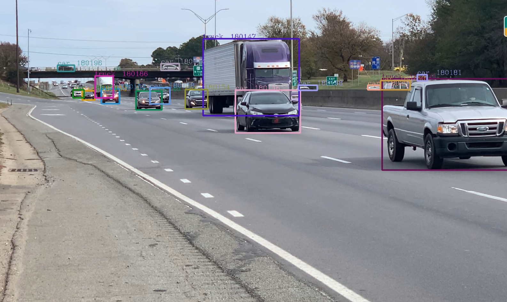
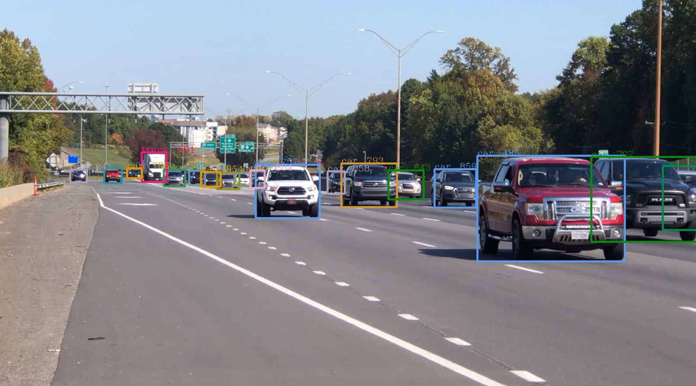
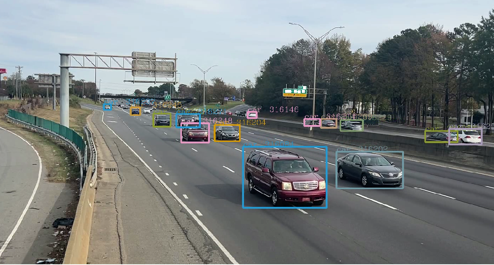
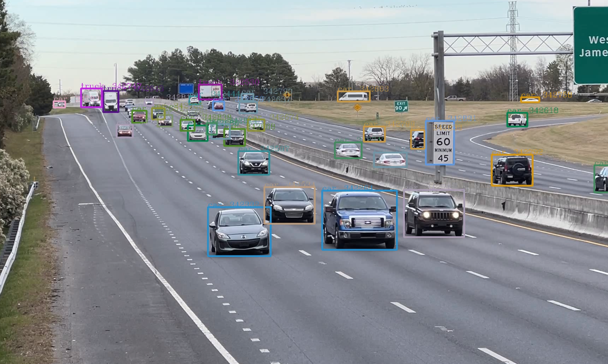
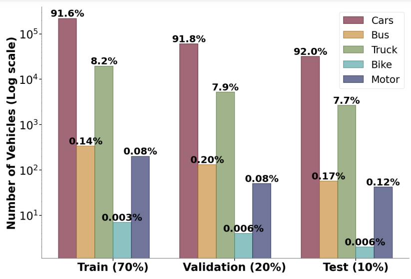

# The Carolinas Dataset

## Overview

The Carolinas dataset is a comprehensive collection of vehicle trajectory data obtained from two distinct points of view: eye-level and high-angle, as depicted in the following figures. The dataset consists of over 338,000 vehicle trajectories on highways across North Carolina and South Carolina, recorded at eight locations in five cities and towns within these two states, with a minimum trajectory duration of 4 seconds. In addition to trajectory data, the Carolinas dataset includes raw and annotated videos of highway traffic, spanning up to 7.5 hours and comprising 1.6 million frames and 33.47 million bounding box annotations.

<!-- <table>
    <caption>Figure 1:Examples of images from the Carolinas Dataset captured from different points of view (POVs). (a) and (b) depict images obtained from an eye-level POV, captured by a camera placed at a height of approximately 5.5 feet, facing the oncoming traffic. (c) and (d) show images obtained from a high-angle POV, captured by a camera placed at a height of approximately 15 feet with a slight downward tilt.</caption>
  <tr>
    <td style="text-align: center;">(a) </td>
    <td style="text-align: center;">(b) </td>
    <td style="text-align: center;">(c) </td>
    <td style="text-align: center;">(d) </td>
  </tr>
</table> -->

<table>
    <caption>Figure 1:Examples of images from the Carolinas Dataset captured from different points of view (POVs). (a) depicts image obtained from an eye-level POV, captured by a camera placed at a height of approximately 5.5 feet, facing the oncoming traffic. (b) shows image obtained from a high-angle POV, captured by a camera placed at a height of approximately 15 feet with a slight downward tilt.</caption>
  <tr>
    <td style="text-align: center;">(a) </td>
<!--     <td style="text-align: center;">(b) </td> -->
    <td style="text-align: center;">(b) </td>
<!--     <td style="text-align: center;">(d) </td> -->
  </tr>
</table>

## Link to Dataset
[Link to Carolinas Eye-level dataset](https://drive.google.com/drive/folders/1UO51kqPLFE3rbsQYdl4iY3GIbOBuI46L?usp=sharing)

[Link to Carolinas High-angle dataset](https://drive.google.com/drive/folders/1wfDB8KxSrirxmtuit9evzqa1Wjgg4FrK?usp=sharing)

## Dataset Statistics

The Carolinas trajectory dataset consists of 338,000 trajectories extracted from 16 videos at the frame rate of 60 Hz and 5 Hz. The dataset is distributed uniformly between training, validation and test sets, with 70% belonging to training set, 20% belonging to validation set and 10% belonging to test set. The dataset consists of five different classes of vehicles and the distribution of different classes across training, validation and test set is presented in the following figure. It can be seen that dataset has around 90% cars and the rest 10% is divided between bus, truck, bike and motor categories. Similar trends were also observed in previous studies.

<figure>
  
  <figcaption>Figure 2: Distribution of Vehicle Classes</figcaption>
</figure>

## Data Collection and Extraction

The videos were recorded in full HD resolution (1920 x 1080) at 60 frames per second (fps) and saved in the highest possible quality. Recordings were conducted at various intervals between 9 AM to 7 PM, strategically scheduled across morning, afternoon, and evening hours to capture a diverse representation of traffic patterns and naturalistic driver behaviors.

To extract vehicle trajectories from the videos, we combined YOLOv5 and ByteTrack. The trajectories of detected and tracked vehicles were extracted using the center of the bounding box as the coordinate at 5 fps and 60 fps. The data was extracted at 5 fps, as it is the frame rate used by most vehicle trajectory prediction models. Unique trajectories of a minimum of 4 seconds and above were included to facilitate the use of this dataset for real-world models with minor input and output windows. Stationary vehicles and vehicles moving away from the camera were filtered out, as they were not the focus of this dataset's applications. False detections were removed to improve the overall accuracy of the dataset. In the final step, interpolation was performed to fill in any missing data across frames.

## Dataset Format

The dataset comprises three components for each recording: the raw and annotated videos, and two data files that contain the annotated data and extracted trajectories, respectively. Trajectory data files are split into training, validation, and test sets. The annotation data file is in CSV format and includes information such as the frame number, vehicle identification number, coordinates of the bounding box center, vehicle type, and coordinates of the bounding box boundaries.

### Following works were used in creation of this dataset:
[Zhang, Yifu and Sun, Peize and Jiang, Yi and Yu, Dongdong and Weng, Fucheng and Yuan, Zehuan and Luo, Ping and Liu, Wenyu and Wang, Xinggang, 2022](https://arxiv.org/abs/2110.06864)

[YoloV5_DeepTrack](https://github.com/Naughty-Galileo/YoloV5_MCMOT)

[YoloV5](https://github.com/ultralytics/yolov5)

[ByteTrack](https://github.com/ifzhang/ByteTrack)
